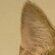
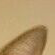
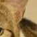
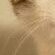
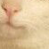
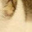

# 九图

### 将一张图片切割为九张小图片，用于微信朋友圈。

### 依赖

Python 2.7

PIL: pip install pillow

### 说明

输入图片若不是方形将会根据较小边对较大边进行居中裁切。

### 使用方法

命令行：

python main.py image_path

也可以将这个类作为一个模块导入自己的项目：

```python
from main import NinePictures

app = NinePictures(image_path)
image_list = app.process()
```
返回的`image_list`是一个`PIL.Image`的对象列表，为处理好的九张图片。

示例：

`python main.py header.png`

原图：


结果：

|:-------------:|:-------------:|:-----:|
||||
||||
||||